# 🎨 Diagrammes UML - Application de Gestion de Consulting

## 1. Diagramme de Cas d'Utilisation (Use Case Diagram)

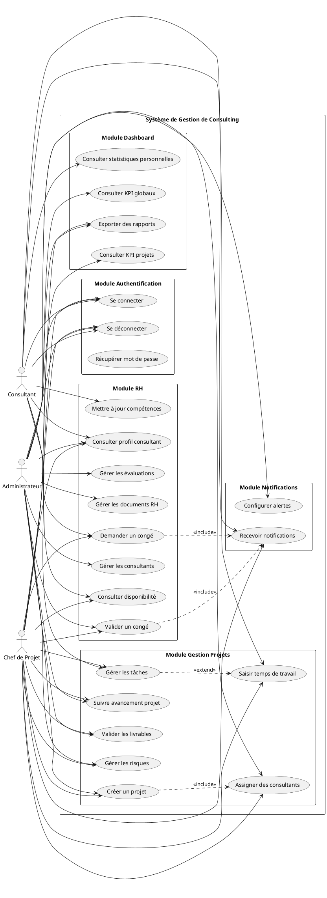

---

## 2. Diagramme de Classes (Class Diagram)

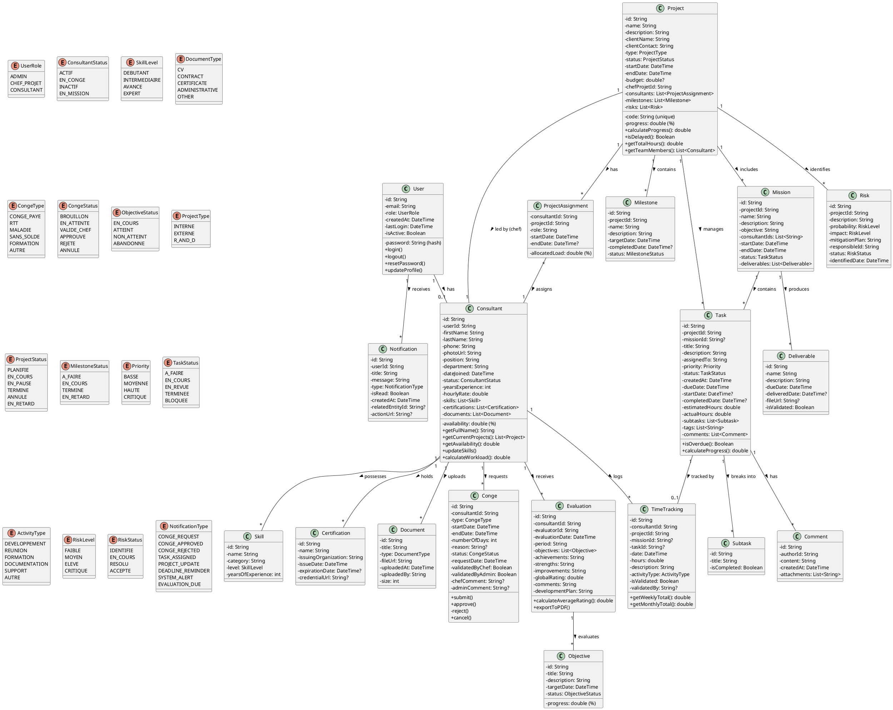

---

## 3. Diagrammes de Séquence

### 3.1 Séquence: Authentification Utilisateur

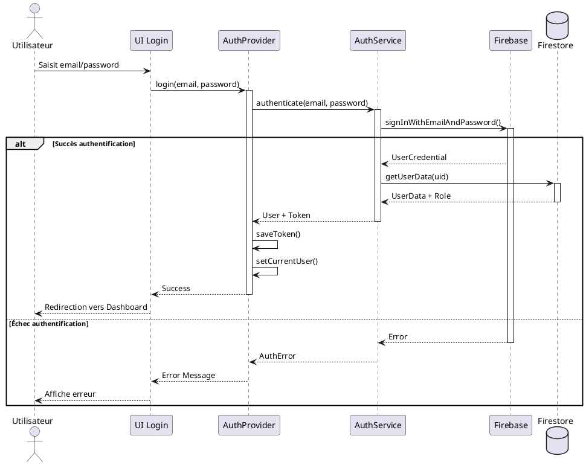

### 3.2 Séquence: Demande de Congé

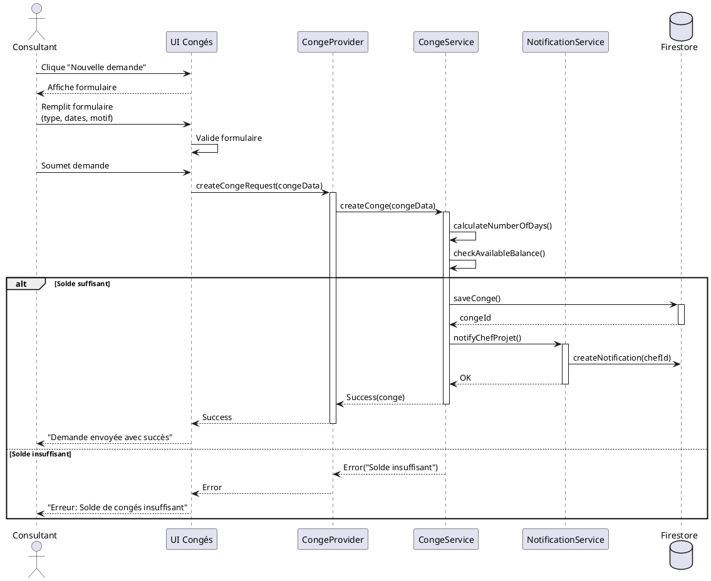

### 3.3 Séquence: Validation de Congé (Workflow)

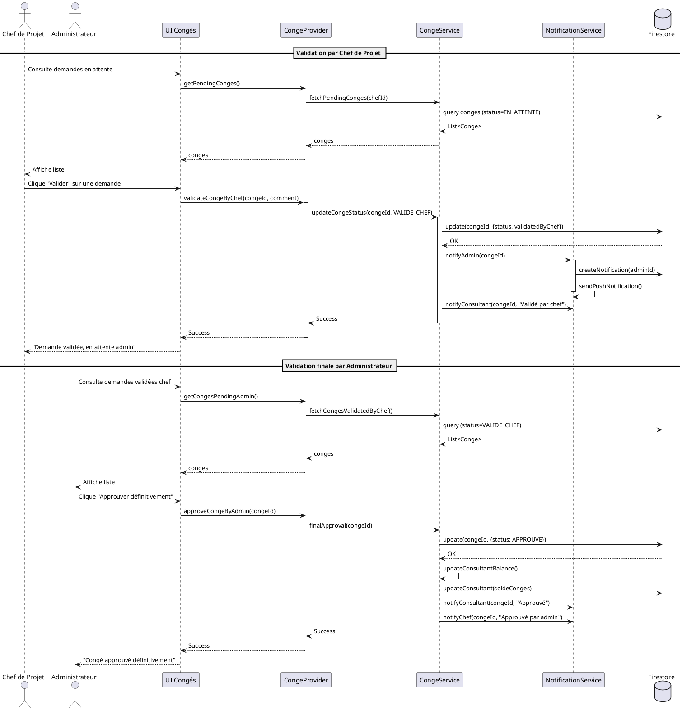

### 3.4 Séquence: Création de Projet et Assignation

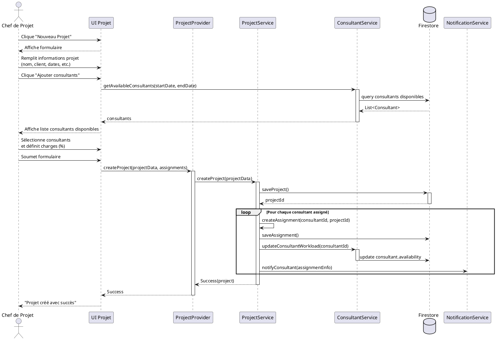

### 3.5 Séquence: Saisie de Temps de Travail

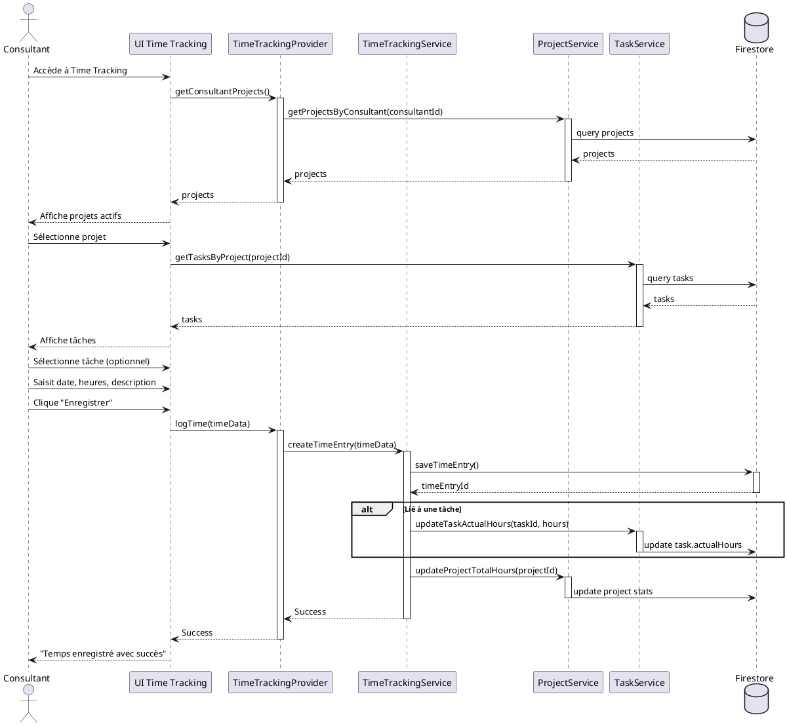

---

## 4. Diagramme d'États (State Diagram)

### 4.1 États d'un Congé

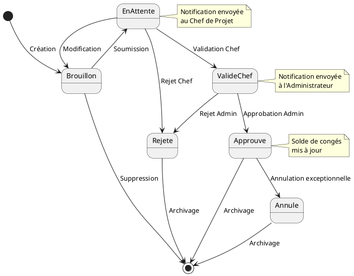

### 4.2 États d'un Projet

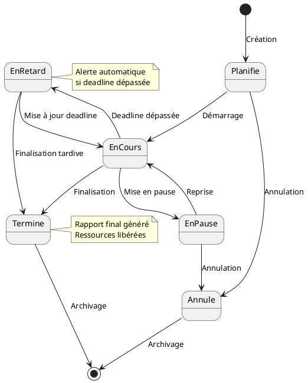

### 4.3 États d'une Tâche

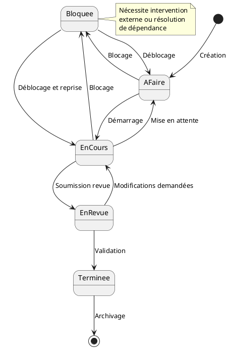

---

## 5. Diagramme de Composants

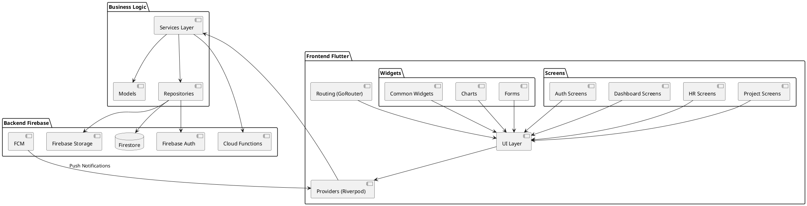

---

## 6. Diagramme de Déploiement

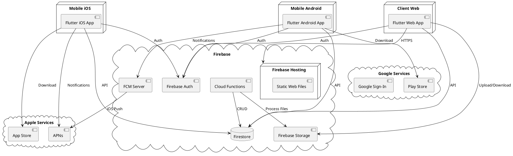

---

**Note:** Ces diagrammes UML peuvent être rendus avec PlantUML. Ils fournissent une vue complète de l'architecture, des flux de données et des interactions du système.

**Version:** 1.0
**Date:** 17 Novembre 2025
